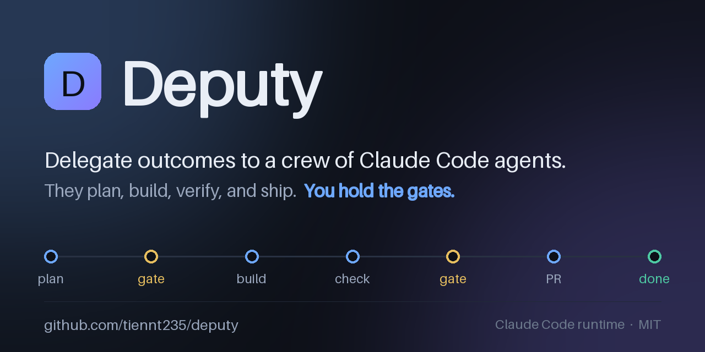

<p align="center">
  
</p>

# Deputy

Deputy turns Claude Code into a managed, self-running development loop. You describe *what*
you want (and why) through a web dashboard; a crew of agents plans, builds, verifies, and
ships it — pausing only at the two decisions that are genuinely yours: **approve the plan**
and **approve the diff**.

Grounded in "loop engineering" (design the system that does the work) and manager-style
delegation (ask for outcomes, not step-by-step actions).

## Quick start

Prereqs: Node 20+, `pnpm`, Docker, and a logged-in `claude` CLI (agents inherit its auth — no API key needed).

```bash
deputy up          # starts Postgres + builds the UI + serves everything on one port
# → open http://localhost:4000
```

Commands: `deputy up · down · restart · status · logs · rebuild`.
All state lives in **`~/.deputy/`** (Postgres data, cloned repos, per-task worktrees, logs).

First time from source:
```bash
git clone <this repo> && cd deputy
ln -sf "$PWD/bin/deputy" ~/.local/bin/deputy    # put `deputy` on your PATH
deputy up                                        # installs deps + builds on first run
```

## Onboard a project

Open the dashboard → **Help** for the full walkthrough. In short:
1. **Projects → New project**
2. **Repos** — register your repo by its absolute local path (add a Git URL for push + PR); mono or multi-repo.
3. **Memory / Harness / Skills** — conventions, model + permissions, and reusable `SKILL.md` know-how.
4. **Tasks → Start loop** — describe an outcome, pick repos, approve the plan and diff at the gates.

Your working copy is never touched — each task runs in an isolated git worktree on a
`deputy/<task>` branch under `~/.deputy/worktrees`.

## How a task flows

```
backlog → planning → plan_review* → executing → checking → human_review* → pr_open → done
                         (gate)    (maker,      (evidence      (gate)
                                    rollback     run +
                                    on failure)  checker)
```
`*` = your gate. A read-only **planner** proposes a plan; the **maker** implements in a
worktree (failed runs auto-roll back); an **evidence** agent actually runs the change and a
fresh-context **checker** reviews the diff; you approve; Deputy commits and opens a PR for
repos with a remote. Failed evidence or checker verdicts loop back to the maker.

## Architecture

- `apps/api` — Fastify + tRPC + WebSocket, the orchestrator (task state machine), scheduler; serves the built dashboard in app mode.
- `apps/web` — React + Vite dashboard.
- `packages/core` — domain types + lifecycle state machine.
- `packages/db` — Prisma schema + client (Postgres).
- `packages/git` — repo-agnostic worktree manager (create, diff, snapshot/rollback).
- `packages/runtime` — `SessionRunner` wrapping the Claude **Agent SDK** (`query()`), permission gating, event mapping.

`docker-compose.yml` runs only the database; the API + web run on the host because the agent
runtime needs your `claude` auth, your repos at their real paths, and each project's toolchain.

## Development

```bash
./start.sh         # dev mode: Postgres (compose) + API (:4000) + Vite web (:5173) with hot reload
pnpm -r typecheck
```

Full lifecycle, headless: `cd apps/api && pnpm exec tsx --env-file=../../.env src/e2e.ts <a-git-repo>`
